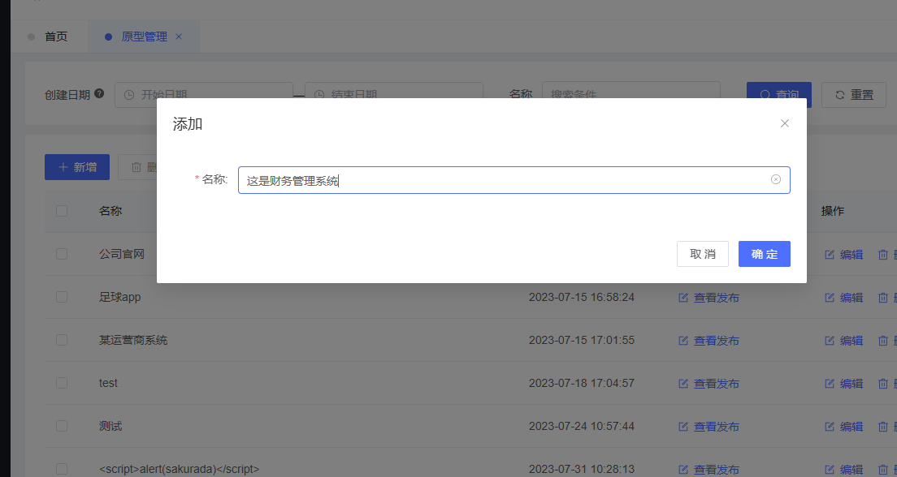
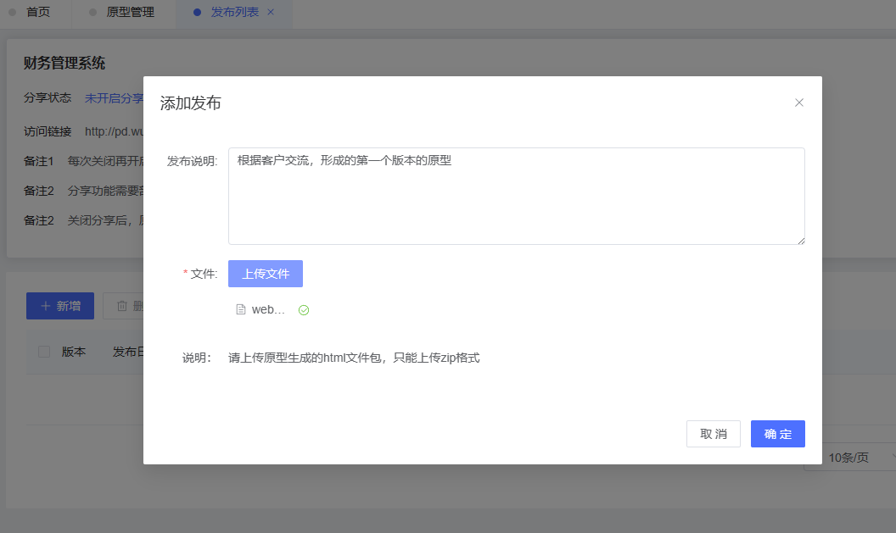
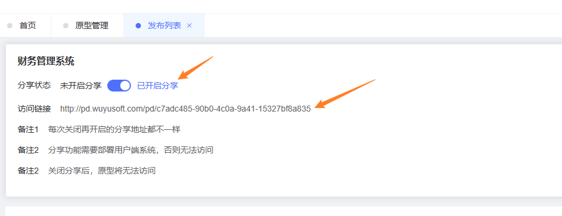
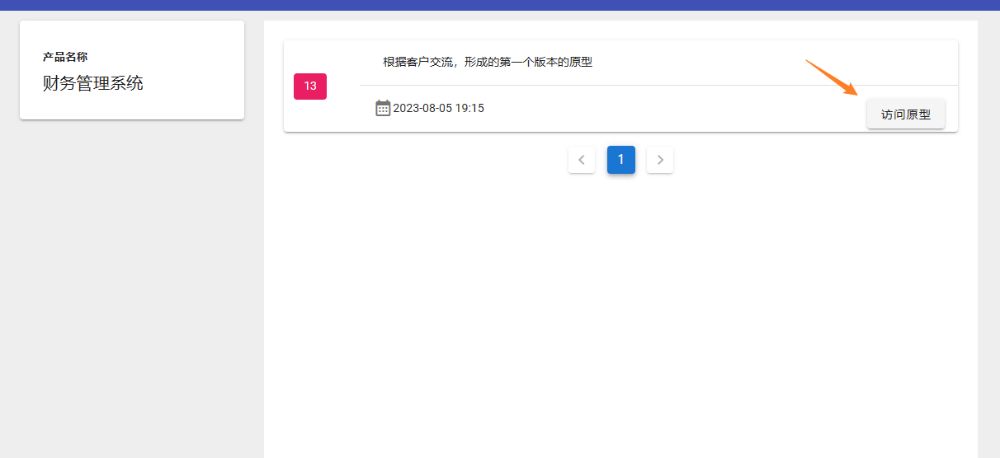
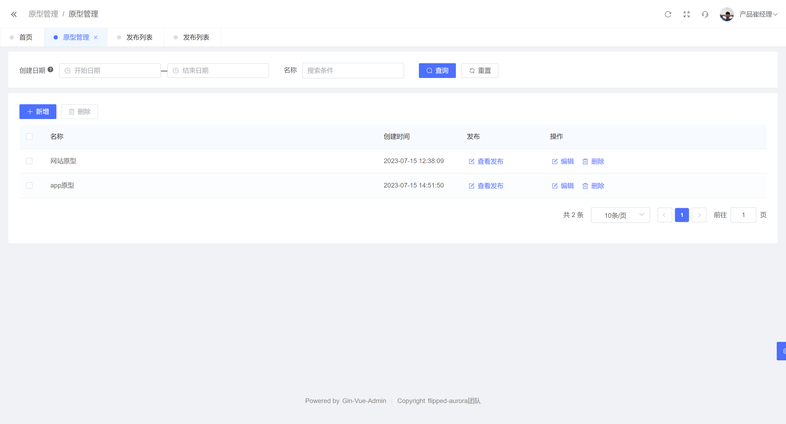
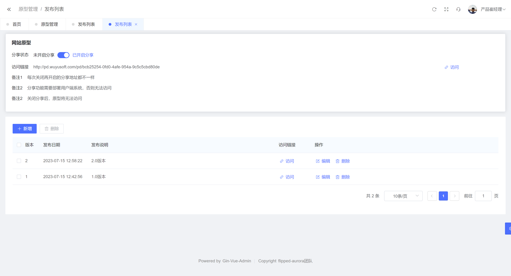
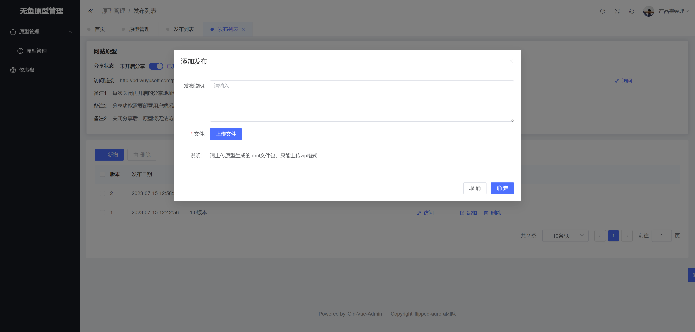
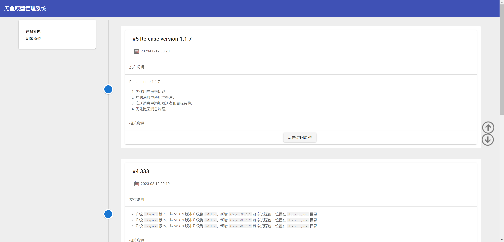
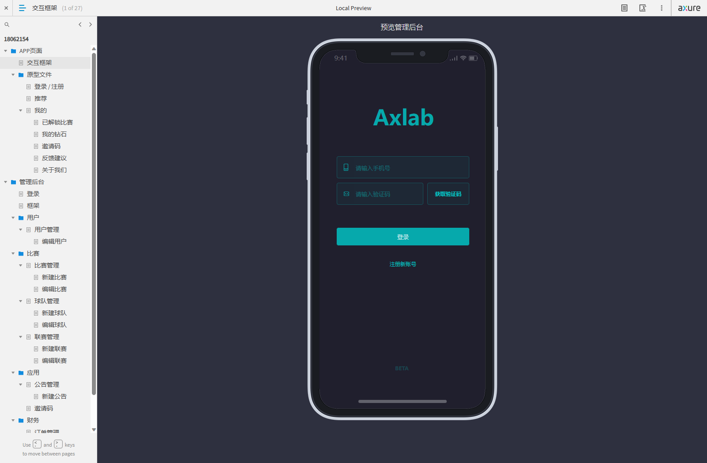
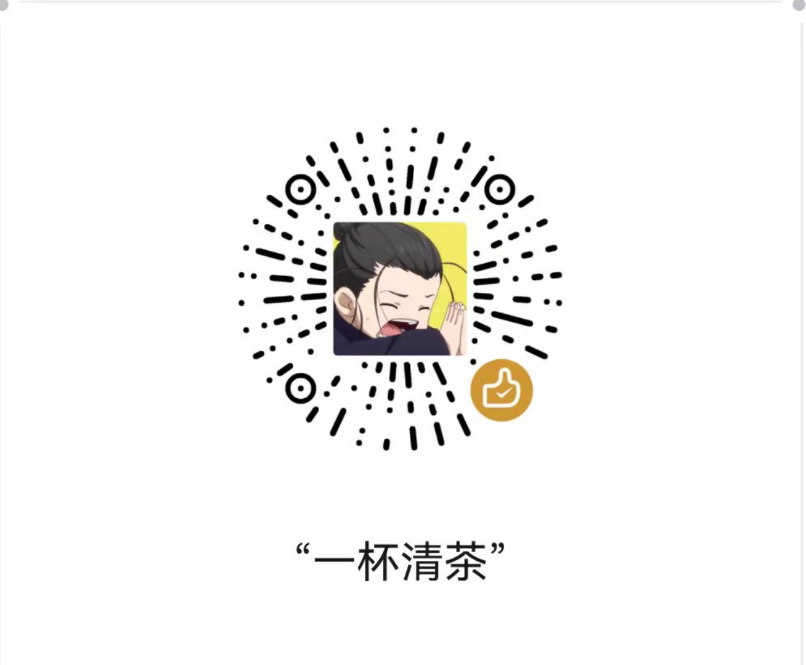

## 介绍
一个简单的管理产品原型和分享的系统，个人及企业免费使用。

## 软件架构

本项目基于前后端分离架构：
服务端：gin+gorm  （基于go-vue-admin框架）
前端管理端： vue3、elementui
前端分享端： vue2、vuetify

| 目录  | 说明  |
|---|---|
| server | 后端  |
| web  | 前端管理端 |
| front | 前端分享端  |
| deploy  | 部署相关工具  |

## 使用说明

1. 创建一个原型

2. 新增一个发布，并上传已经生成好的html文件压缩包（推荐使用axure）

3. 开启分享，并将链接发送给同事或者客户。

4. 对方直接打开，即可查看原型文件。

5.当有后续版本更新时，该链接依旧保持不变，客户可随时刷新查看最新的原型列表。

## 部署方式

### 1. windows
- 下载deploy文件夹，找到windows 目录

- 安装目录下的readme进行数据库部署

- 运行目录下server.exe 

- 系统即开始运行

- 登录使用

### 2. linux
推荐使用compose方式，该脚本已经打包好mysql、nginx以及后端程序
- 下载deploy文件夹，找到compose 目录

- 进入compose 目录

- 运行 docker compose up   (或者 docker compose up -d)

- 系统即开始运行

- 登录使用

## 功能截图

## 演示环境

### 管理端： 

http://pd.wuyusoft.com/admin

| #| 角色 |	 账号 | 	密码    |  权限 |
| :--: | :------: | :------: |:------: | ---------- |
|演示环境账号1 |产品经理 | 	pmtest1|	123456|发布原型|

### 原型查看端

[点击访问](http://pd.wuyusoft.com/front/#/pd/dcec94df-35f4-40e1-b6ec-5d19ea7c61ae)

## 相关说明

部署nginx和前端文件，请参考deploy中的nginx.conf的配置内容。

提供了自行部署mysql、redis、nginx等服务的方式，也可以使用原有的服务。需要自行进行前端代码编译。

### 环境相关

默认管理账号：
admin
默认密码：
123456

## 其他说明
开源免费，无特殊授权要求。

后续版本规划，交流咨询请加QQ群:7834330。

## 感谢
感谢go-vue-admin、ele-admin-ui、vuetify等相关

## 捐赠
如果帮助到你，可以请作者喝杯茶。

